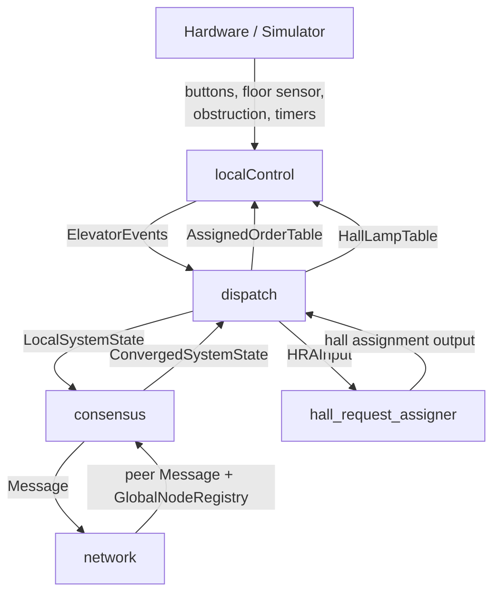

# Distributed Elevator Controller

This repository contains our project in **TTK4145 Real-Time Programming**. It
is a distributed elevator controller written in Go, where each process controls
one elevator and communicates with the others over a peer-to-peer UDP network.

There is no master node. All elevators run the same program, exchange `Message`
snapshots, and build their own view of the shared system state. The main goal
is to get a consistent distributed view of orders and elevator state, and use
that view as the basis for deterministic hall call assignment.

At the same time, the order handling is designed to be fault-tolerant, so the
system can keep working through network loss, packet loss, power loss, and
motor-related problems.

## Fault Tolerance

The most important design idea is that the system should keep working
reasonably even when something goes wrong.

- The network layer is peer-to-peer over UDP, so the system does not depend on
  one central controller.
- Peers keep rebroadcasting `Message` snapshots, and `consensus` only publishes
  `ConvergedSystemState` after repeated matching snapshots from alive peers.
  This gives all elevators a shared distributed view before hall assignment is
  run.
- Hall calls are assigned deterministically from `ConvergedSystemState`, which
  means the elevators use the same input when deciding who should serve a hall
  call.
- Both hall and cab orders use the same `OrderState` cycle in the replicated
  `OrderTable`.
- An order is not removed just because communication is bad. It must move
  through the cycle and be marked `OrderComplete` before it returns to
  `OrderStandby`.
- Hall lights follow assigned hall orders, so a lit hall button still
  represents an order that the system believes must be served.
- If peer snapshots diverge too much, the order falls back to `OrderStandby`
  instead of keeping a bad distributed state alive.
- If `hall_request_assigner` is unavailable, `fallbackAssignedOrders` still
  keeps local `BtnCab` requests active and handles hall requests
  conservatively.
- A node can still take part in replication even if it is temporarily not
  assignable, for example during obstruction or motor timeout.

In practice, this means the system may react more slowly under heavy packet
loss, but the design tries to avoid lost calls, wrong assignments, and stale
distributed state.

## Order Model

The project uses one unified `OrderTable` for:

- `BtnHallUp`
- `BtnHallDown`
- `BtnCab`

Each entry is an `OrderState` and follows the same cycle:

`OrderStandby -> OrderPending -> OrderAssigned -> OrderComplete -> OrderStandby`

This cycle is a key part of the fault tolerance. It means that both hall and
cab orders stay in the distributed state until they have actually gone through
assignment and completion.

Hall and cab calls share the same state machine, but they are still used
differently:

- `BtnHallUp` and `BtnHallDown` are assigned from `ConvergedSystemState`
  through `HRAInput` and `hall_request_assigner`.
- `BtnCab` is executed locally through `AssignedOrderTable`.

## Architecture

The normal runtime flow is:



Main modules:

- `localControl`
  Runs the local elevator FSM, polls inputs, and controls motor, lamps, and
  door.

- `dispatch`
  Maintains `LocalSystemState`, updates `OrderStates`, merges converged orders,
  and produces `AssignedOrderTable` and `HallLampTable`.

- `consensus`
  Tracks alive peers, stores peer snapshots, advances `OrderTable`, and
  publishes `ConvergedSystemState`.

- `network`
  Handles UDP broadcast, peer discovery, and rebroadcast of the latest
  `Message`.

## Repository Layout

```text
elevator/
  cmd/
    elevator/            entry point
  internal/
    config/              constants, timing, and CLI args
    consensus/           peer state and OrderTable convergence
    dispatch/            LocalSystemState and hall assignment
    localControl/        elevator FSM and hardware control
    network/             UDP broadcast, peers, packet loss tools
    types/               shared types

Simulator-v2-master/     simulator binaries, config, and docs
```

## Running

The Go module for the controller lives in `elevator/`.

If you run multiple elevators on one machine, start one simulator per elevator
with a unique TCP port. Use the simulator binary that matches your platform in
`Simulator-v2-master/`.

Example:

```bash
cd Simulator-v2-master
./SimElevatorServer_mac --port 15657
./SimElevatorServer_mac --port 15658
./SimElevatorServer_mac --port 15659
```

Then start one controller process per elevator:

```bash
cd elevator
go run ./cmd/elevator --id 0 --port 15657
go run ./cmd/elevator --id 1 --port 15658
go run ./cmd/elevator --id 2 --port 15659
```

You can also use `--addr host:port` instead of `--port`.

The system size is set in `elevator/internal/config/config.go`, so it is not
hardcoded to one exact setup. Important defaults are:

- `NFloors = 4`
- `NButtons = 3`
- `NElevators = 3`
- `BroadcastPort = 13333`
- `PeersPort = 13334`
- `DoorOpenTime = 3s`
- `MotorTimeout = 4s`

## Packet Loss Testing

The repository includes `elevator/internal/network/packet_loss/packetloss.sh`.
It uses `iptables`, so it is mainly intended for Linux.

Example:

```bash
sudo ./elevator/internal/network/packet_loss/packetloss.sh 30 -i 13333 13334
```

This is useful for testing:

- delayed convergence
- restart recovery
- repeated messages
- divergence between peer snapshots
