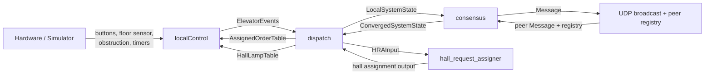

# Distributed Elevator Controller

This project is a distributed elevator controller written in Go. Each node runs
one elevator locally, shares `Message` snapshots with the other elevators over
UDP, and uses `hall_request_assigner` to assign `BtnHallUp` and `BtnHallDown`
requests.

The main idea is to keep the replicated `OrderTable` and
`ConvergedSystemState` progressing predictably even when `Message` snapshots are
delayed, repeated, or lost.

## How It Works

- Each elevator runs the same program. There is no central master.
- `localControl` handles the hardware or simulator connection and executes a
  local `AssignedOrderTable`.
- `dispatch` consumes `ElevatorEvents`, updates `LocalSystemState`, merges
  `ConvergedSystemState`, computes `AssignedOrderTable`, and builds
  `HallLampTable`.
- `consensus` consumes `LocalSystemState`, `Message`, and `GlobalNodeRegistry`,
  advances `OrderTable` entries through the shared `OrderState` cycle, and
  publishes `ConvergedSystemState` when alive peers have consistent repeated
  snapshots.
- `network` rebroadcasts the latest `Message` over UDP broadcast and forwards
  `GlobalNodeRegistry` updates.
- Every `OrderState` entry in `OrderTable` follows the same cycle:
  `OrderStandby -> OrderPending -> OrderAssigned -> OrderComplete -> OrderStandby`
- The unified `OrderTable` stores `BtnHallUp`, `BtnHallDown`, and `BtnCab` in
  the same `[NFloors][NButtons]` structure.
- `BtnCab` requests stay active through `AssignedOrderTable` whenever
  `IsActiveOrder(...)` is true.
- `BtnHallUp` and `BtnHallDown` are assigned from `ConvergedSystemState`
  through `HRAInput` and `hall_request_assigner`.
- If peer observations diverge too much, the order falls back to
  `OrderStandby` instead of letting a diverged distributed state persist.

This gives the system two main safeguards:

- repeated `Message` snapshots help the replicated state converge
- diverging peer snapshots are handled by falling back to `OrderStandby`

## Architecture

- `localControl`
  Drives the elevator, polls hardware, and controls lamps, door, and motor.

- `dispatch`
  Maintains `LocalSystemState`, merges `ConvergedSystemState.OrderTables`,
  computes `AssignedOrderTable`, and produces `HallLampTable`.

- `consensus`
  Tracks peers, advances `OrderTable` state, and publishes
  `ConvergedSystemState` when alive peers keep sending matching snapshots.

- `network`
  Handles UDP broadcast, peer discovery, and rebroadcast of the latest
  `Message`.



## Design Choices

- One replicated `OrderTable` type is used for `BtnHallUp`, `BtnHallDown`, and
  `BtnCab`.
- Hall assignment is only run from `ConvergedSystemState` through `HRAInput`.
- If `hall_request_assigner` is unavailable, `fallbackAssignedOrders` keeps
  local `BtnCab` requests active and handles hall requests conservatively.
- A node can stay alive for replication even if `HRAElevState.Assignable` is
  false, for example during obstruction or motor timeout.
- The system favors safe recovery over fast progress under bad networking.

In practice, this means the system may become slower under heavy packet loss,
but it is less likely to let a diverged distributed order state persist.

## Repository Layout

```text
elevator/
  cmd/
    elevator/            entry point
  internal/
    config/              constants, timing, and CLI args
    consensus/           peer state and OrderTable convergence
    dispatch/            LocalSystemState and hall assignment
    localControl/        elevator FSM and hardware control
    network/             UDP broadcast, peers, packet loss tools
    types/               shared types

Simulator-v2-master/     simulator binaries, config, and docs
```

## Running

The Go module for the controller lives in `elevator/`, so run the application
from there.

If you run multiple elevators on one machine, start one simulator per elevator
with a unique TCP port. Use the simulator binary that matches your platform from
`Simulator-v2-master/`.

Example simulator ports:

```bash
cd Simulator-v2-master
./SimElevatorServer_mac --port 15657
./SimElevatorServer_mac --port 15658
./SimElevatorServer_mac --port 15659
```

Then start one controller process per elevator:

```bash
cd elevator
go run ./cmd/elevator --id 0 --port 15657
go run ./cmd/elevator --id 1 --port 15658
go run ./cmd/elevator --id 2 --port 15659
```

You can also use `--addr host:port` instead of `--port`.

Important defaults in `elevator/internal/config/config.go`:

- `NFloors = 4`
- `NButtons = 3`
- `NElevators = 3`
- `BroadcastPort = 13333`
- `PeersPort = 13334`
- `DoorOpenTime = 3s`
- `MotorTimeout = 4s`

## Packet Loss Testing

The repository includes `elevator/internal/network/packet_loss/packetloss.sh`.
It uses `iptables`, so it is mainly intended for Linux environments.

Example:

```bash
sudo ./elevator/internal/network/packet_loss/packetloss.sh 30 -i 13333 13334
```

This is useful for testing:

- delayed convergence
- restart recovery
- repeated messages
- divergence between peer snapshots
