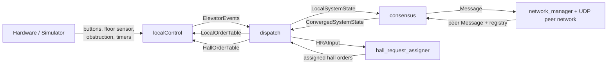

# Distributed Elevator Controller

This project is a distributed elevator controller written in Go. Each node runs
one elevator locally, shares state with the other elevators over UDP, and uses
a deterministic hall request assigner to decide who should serve hall calls.

The main idea is to make the system behave reasonably even when messages are
delayed, repeated, or lost.

## How It Works

- Each elevator runs the same program. There is no central master.
- Local hardware is handled in `localControl`.
- Local events are translated into replicated state in `dispatch`.
- Nodes exchange snapshots over a peer-to-peer UDP network.
- Hall and cab orders both move through the same cycle:
  `Standby -> Pending -> Assigned -> Complete -> Standby`
- A converged distributed system state is used as input to the deterministic
  hall request assigner.
- If peer observations diverge too much, the order falls back to `Standby`
  instead of keeping an unsafe state alive.

This gives the system two main safeguards:

- repeated messages help confirm the same state
- disagreement is handled conservatively instead of guessed away

## Architecture

- `localControl`
  Drives the elevator, polls hardware, and controls lamps, door, and motor.

- `dispatch`
  Turns local events into replicated local state, merges converged orders, and
  runs the hall assignment step.

- `consensus`
  Tracks peers, advances order states, and publishes a converged system view
  when alive peers agree.

- `network`
  Handles UDP broadcast, peer discovery, and rebroadcast of the latest state.



## Design Choices

- Hall assignment is only run from a converged system snapshot.
- Cab calls are replicated through the same state-cycle logic as hall calls.
- A node can stay alive for replication even if it is temporarily unavailable
  for assignment, for example during obstruction or motor timeout.
- The system favors safe recovery over fast progress under bad networking.

In practice, this means the system may become slower under heavy packet loss,
but it is less likely to keep a wrong distributed order state.

## Repository Layout

```text
cmd/elevator/                 Program entry point
internal/config/              Constants and timing
internal/consensus/           Peer state and order convergence
internal/dispatch/            Local state handling and hall assignment
internal/localControl/        Elevator FSM and hardware control
internal/network/             UDP broadcast, peers, packet loss tools
internal/types/               Shared types
```

## Running

Run one process per elevator:

```bash
go run ./cmd/elevator --id 0 --port 15657
go run ./cmd/elevator --id 1 --port 15658
go run ./cmd/elevator --id 2 --port 15659
```

Important defaults in `internal/config/config.go`:

- `NElevators = 3`
- `NFloors = 4`
- `BroadcastPort = 13333`
- `PeersPort = 13334`

## Packet Loss Testing

The repository includes `internal/network/packet_loss/packetloss.sh`.

Example:

```bash
sudo internal/network/packet_loss/packetloss.sh 30 -i 13333 13334
```

This is useful for testing:

- delayed convergence
- restart recovery
- repeated messages
- disagreement between peers

